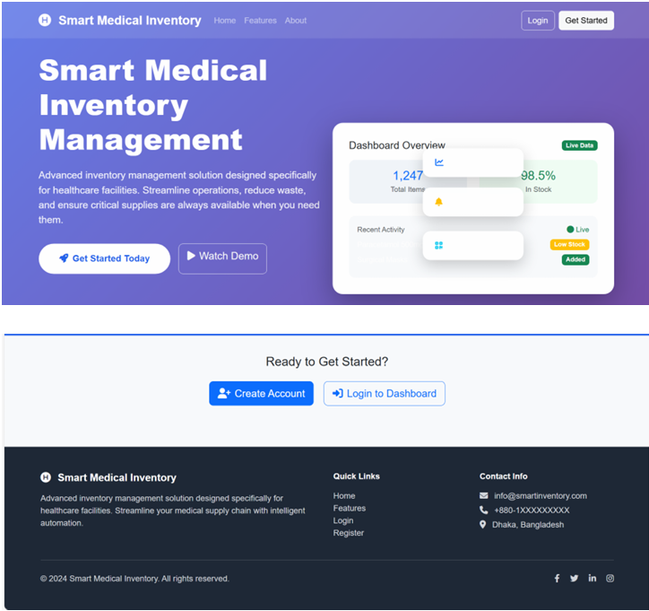
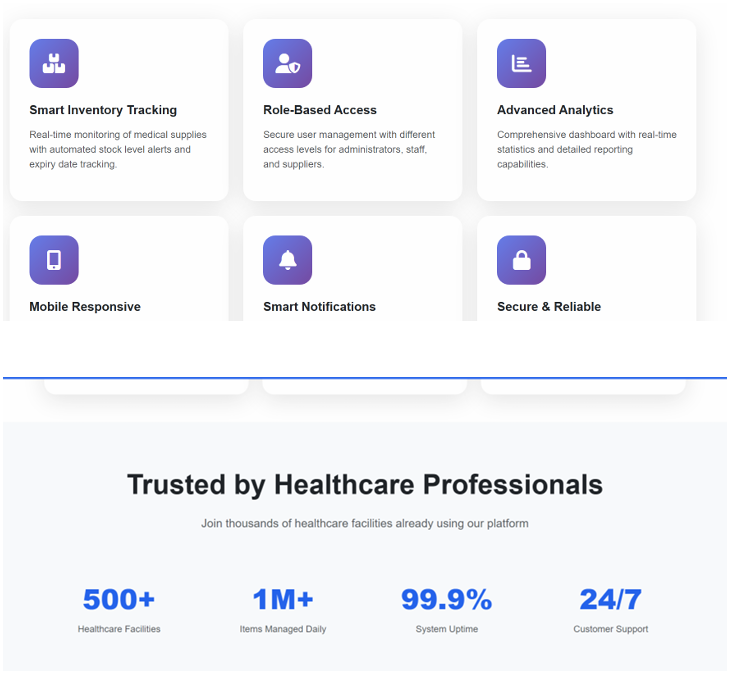
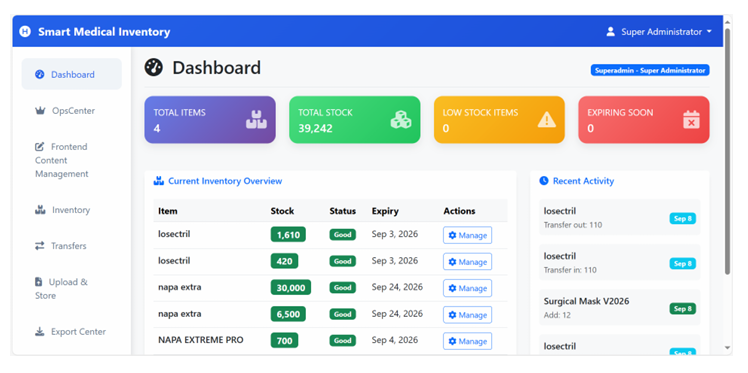
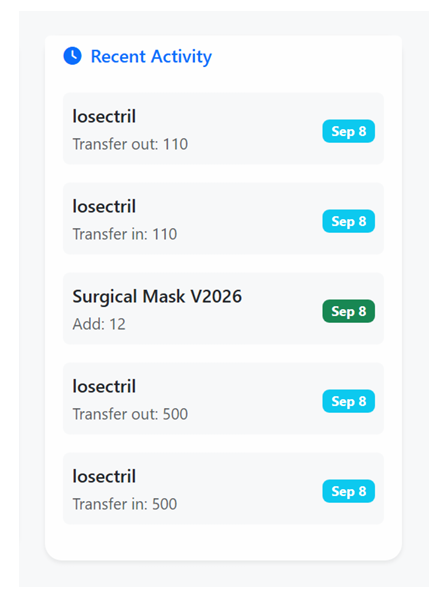
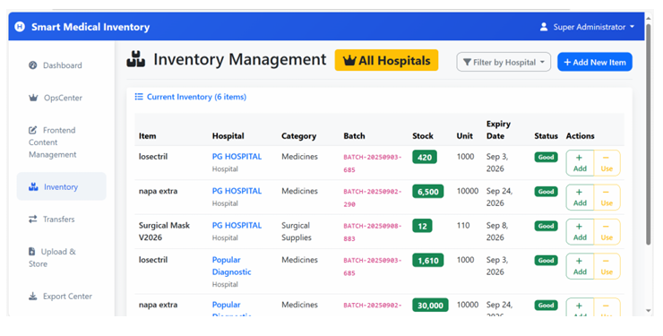
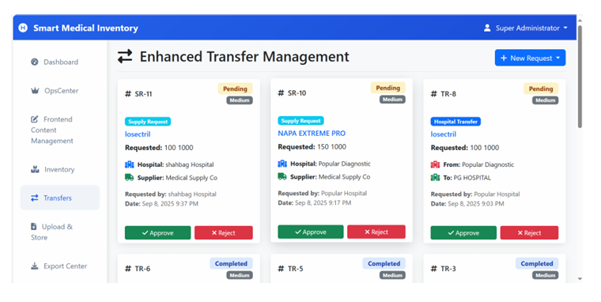
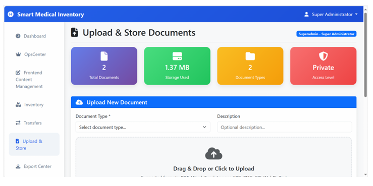
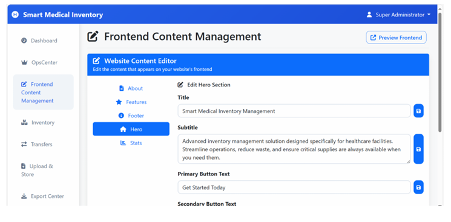
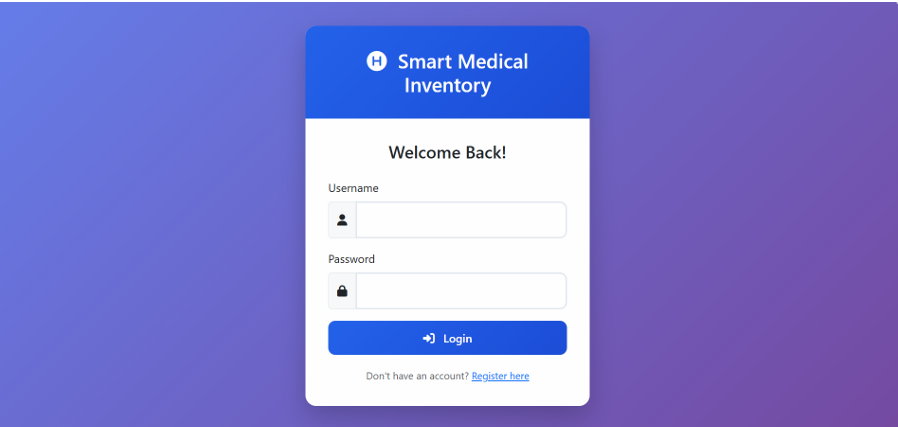
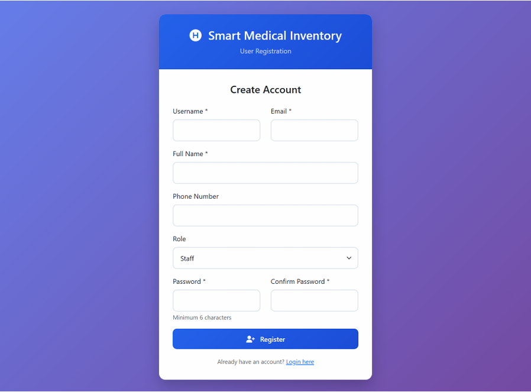

# 🏥 Smart Medical Inventory Management System

[](https://laravel.com)
[](https://www.mysql.com)
[](https://www.php.net)
[](https://opensource.org/licenses/MIT)

**Smart Medical Inventory System** is a comprehensive web-based platform designed to revolutionize healthcare supply management. It enhances inventory management for hospitals and clinics while seamlessly connecting them with medical suppliers in real-time.

---

## 🚀 Key Features

-   **📦 Real-time Stock Control**: Effortlessly add, consume, and manage medical supplies with complete audit trails.
-   **🔔 Smart Alerts**: Automated notifications for low stock levels and near-expiry items to prevent shortages.
-   **🔄 Inter-Hospital Transfers**: Seamlessly transfer critical supplies between healthcare facilities with approval workflows.
-   **📊 Visual Analytics**: Interactive dashboard with real-time charts and insights for data-driven decisions.
-   **🔐 Role-Based Access Control (RBAC)**: Secure multi-user system with specific permissions for Superadmins, Admins, Staff, and Suppliers.
-   **📄 Advanced Reporting**: Export inventory data and transaction history in PDF, Excel, and CSV formats.
-   **📋 Document Management**: Securely upload and manage licenses, certificates, and invoices.

---

## 📸 System Showcase

### 🖥️ Platform Overview
| Landing Page | Key Features Grid |
| :---: | :---: |
|  |  |

### 📊 Management Dashboard
| Visual Analytics Overview | Recent Activity Feed |
| :---: | :---: |
|  |  |

### 📦 Core Inventory Features
| Inventory Management | Inter-Hospital Transfers |
| :---: | :---: |
|  |  |

### 📄 Document & Content control
| Document Storage | Frontend Content Editor |
| :---: | :---: |
|  |  |

### 🔐 Security & Access
| Professional Login | User Registration |
| :---: | :---: |
|  |  |

> [!NOTE]
> All screenshots above are captured directly from the system as showcased in the **Final Project Report (PDF)** to demonstrate the live functionality and premium UI design.

---

## 👥 Meet the Team (Group 8)

| Name | Student ID |
| :--- | :--- |
| **Sabah Maryam** | 22201484 |
| **Shezan Mahmud** | 21301563 |
| **Isat Mahmud Evan** | 21301655 |

---

## 🛠️ Tech Stack

-   **Backend**: Laravel 8+ (PHP 8.2 compatible)
-   **Database**: MySQL / MariaDB
-   **Frontend**: Blade Templating Engine, Vanilla CSS (Glassmorphism UI), FontAwesome 6+
-   **Fonts**: Google Fonts (Inter)
-   **Exporting**: DomPDF / Maatwebsite Excel

---

## 📂 Project Structure

```text
/
├── app/                # Core Application Logic
├── database/
│   └── sql/            # Initial Database SQL Dump
├── docs/               # Project Documentation
│   ├── Diagrams/       # ERD and Relational Models
│   ├── Feature-List/   # Detailed Feature Specifications
│   └── Final-Report/   # Academic Project Report
├── public/             # Entry point (Assets, index.php)
├── resources/          # Views (Blade templates), CSS, JS
├── routes/             # API and Web Routes
└── README.md           # This file
```

---

## 🛠️ Installation & Setup

### Prerequisites
-   PHP 8.2 or higher
-   Composer
-   MySQL / MariaDB
-   XAMPP / WAMP / Laragon (for local development)

### Step-by-Step Guide

1.  **Clone the Repository**
    ```bash
    git clone <your-repository-url>
    cd Smart-Inventory-Database
    ```

2.  **Install Dependencies**
    ```bash
    composer install
    ```

3.  **Environment Configuration**
    -   Copy `.env.example` to `.env`
    -   Update the database credentials:
    ```env
    DB_CONNECTION=mysql
    DB_HOST=127.0.0.1
    DB_PORT=3306
    DB_DATABASE=medical
    DB_USERNAME=root
    DB_PASSWORD=
    ```

4.  **Database Setup**
    -   Create a database named `medical` in your MySQL server.
    -   Import the SQL dump from `/database/sql/smart_medical_inventory.sql` using phpMyAdmin or the CLI.

5.  **Generate Application Key**
    ```bash
    php artisan key:generate
    ```

6.  **Run the Application**
    ```bash
    php artisan serve
    ```
    Access the system at `http://localhost:8000`.

---

## 👤 Contact & Contribution

**Project Group**: Group 8, Section 5
**Course**: CSE370 (Database Systems)
**Institution**: BRAC University

---

## 📄 License

This project is licensed under the [MIT License](LICENSE).
